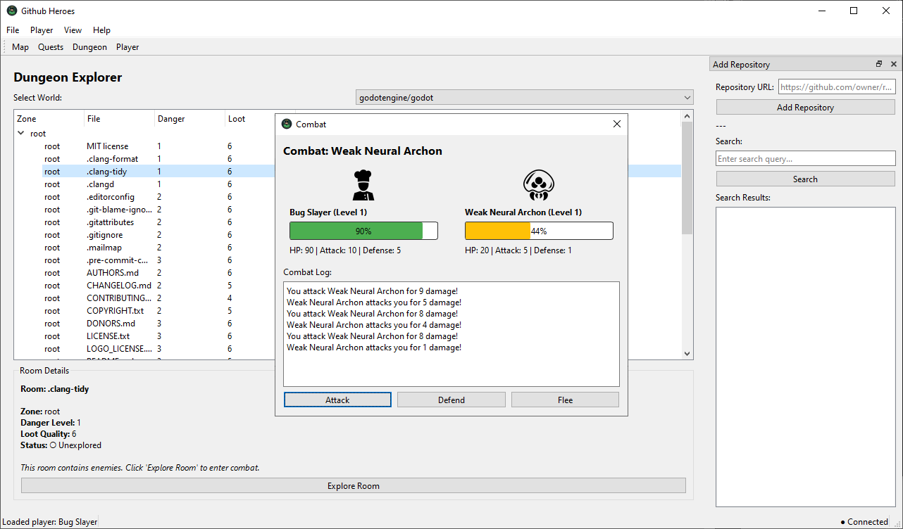

# Github Heroes

An RPG "Github Repo" game that turns GitHub repositories into dungeons, enemies, quests, and loot.



## Description

Github Heroes is a single-player incremental RPG/exploration game built with Python and PyQt6. It parses public GitHub repositories and procedurally generates:

- **Repo Worlds**: Each GitHub repository becomes a dungeon/zone
- **Enemies**: Generated from README content and repository features
- **Dungeon Rooms**: Created from repository file structure
- **Quests**: Issues become regular quests, Pull Requests become boss battles
- **Loot**: Items themed by repository language and features


## Features

- Explore GitHub repositories as RPG dungeons
- Turn-based combat system
- Player progression with XP and leveling
- Inventory system with stat-boosting items
- Quest board for issues and PRs
- World map showing discovered repositories
- Persistent game state in SQLite database

## Requirements

- Python 3.10 or higher
- PyQt6 6.10.0
- requests
- beautifulsoup4
- lxml
- click

On linux, it may be needed to install xcb-cursor0 or libxcb-cursor0 package, as well as fonts to handle Unicode characters.
For instance on Debian the package fonts-recommanded will install font that will handle such characters.

## Installation

1. With uv
```bash
uv pip install .
```

2. With classic venv
```bash
python3 -m venv .venv
. .venv/bin/activate
pip install .
```

## Running

1. With uv
```bash
uv run github-heroes
```

2. With classic venv
```bash
github-heroes
```

## How to Play

1. **Create a Player**: Start a new game and create your character
2. **Discover Repositories**: Use the search panel to add GitHub repositories
3. **Explore Dungeons**: Enter dungeons to explore repository structure
4. **Fight Enemies**: Battle enemies in rooms and complete quests
5. **Level Up**: Gain XP and level up to become stronger
6. **Complete Quests**: Take on issues and PRs as quests and boss battles


## Strategy

- Gain some levels with small repos before attempting large repos and their dangerous dungeons.


## Game Mechanics

- **Enemies**: Generated deterministically from README content
- **Combat**: Turn-based with Attack, Defend, and Flee options
- **Loot**: Items drop after victories, with rarity based on repository stars and health
- **Progression**: Gain XP from defeating enemies, level up to increase stats
- **Quests**: Issues become quests, PRs become boss battles

## Planned Features

- [ ] Improve UI
- [ ] More graphics in UI
- [ ] Sound effects and background music
- [ ] Animation effects for combat and actions
- [ ] Enhanced boss battle mechanics
- [ ] Additional item types and equipment slots
- [ ] Item crafting and upgrading system
- [ ] More enemy variety and behaviors
- [ ] Expanded achievement system
- [ ] Settings menu for game configuration
- [ ] Tutorial/help system for new players
- [ ] Save/export game data functionality
- [ ] Performance optimizations for large repositories

## Technical Details

- Built with PyQt6 for the GUI
- SQLite for persistent game data
- HTTP process repo data
- Background threading for network operations
- Deterministic procedural generation
- Game Image assets from https://game-icons.net/

## Version History

- version 1.0.4: added class system and achievement system. Added quest and dungeon counts to world list. UI tweaks.
- version 1.0.3: added prefix/suffix system to enemy generation
- version 1.0.2: combat interface update, enemy graphics, inventory changes, profile changes
- version 1.0.1: app icons
- version 1.0.0: initial push

## Contributors

- see AUTHORS.md

## Contributing

We welcome contributions! If you'd like to contribute to Github Heroes, please feel free to:

- Open an issue to report bugs or suggest new features
- Submit a Pull Request with your improvements
- Share feedback and ideas

When submitting a PR, please make sure your code follows the existing style and includes appropriate comments. We appreciate all contributions, big or small!

## NOTES

- updates may break existing save games and may require starting fresh.

## License

This project is provided under the MIT license.

